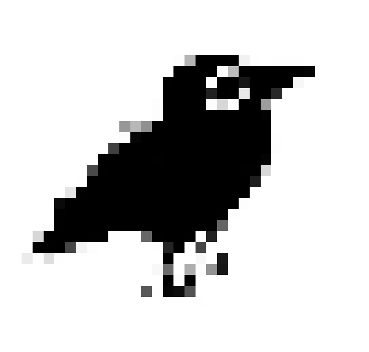
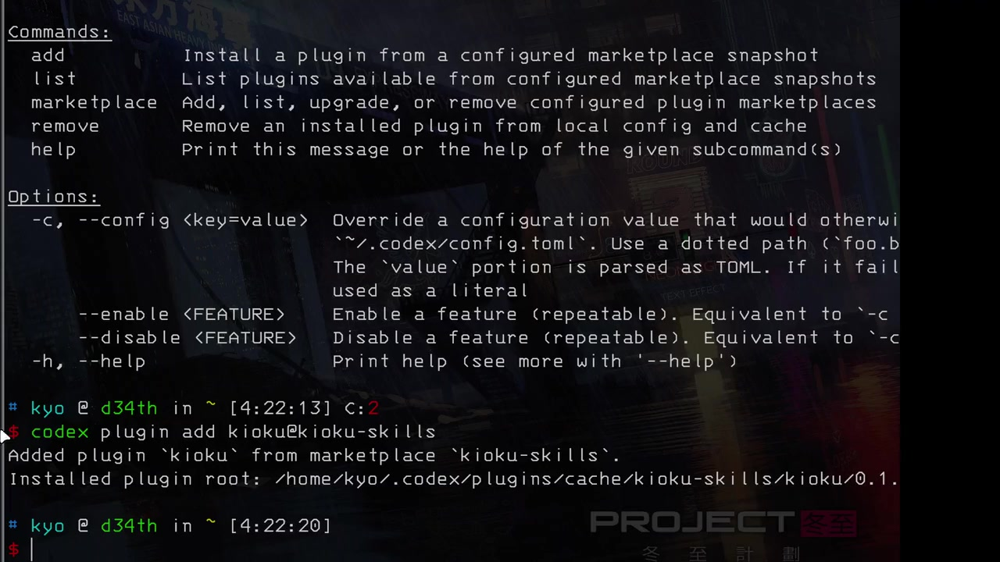

  

<h1 align="center">Kioku</h1>

  <strong>AI Context Manager</strong>

  Capture, store, and retrieve knowledge from meetings, documents, and conversations.
   
  Open source, self-hostable, REST + MCP.

  
  
  
  
  

<!-- 

  
  
  
  
  

 -->

  <a href="https://docs.kioku.chat"><strong>Documentation</strong></a>
  <!-- · -->
  <!-- <a href="https://github.com/kioku-org/kioku"><strong>GitHub</strong></a> -->
  ·
  <a href="https://github.com/kioku-org/kioku/issues"><strong>Issues</strong></a>
  <!-- · -->
  <!-- <a href="mailto:hello@kioku.chat"><strong>Contact</strong></a> -->

 

## Showcase

  

  <a href="./assets/showcase.mp4"><strong>Watch the showcase</strong></a>

## Documentation

The complete documentation is available at **[docs.kioku.chat](https://docs.kioku.chat)**.

* **[Quick Start](https://docs.kioku.chat/quickstart)** — Get Kioku running locally in five minutes
* **[Architecture](https://docs.kioku.chat/architecture)** — Learn how Hivemind, Vexa, and the CLI fit together
* **[API Reference](https://docs.kioku.chat/api/authentication)** — Explore the REST API and authentication flow
* **[MCP Integration](https://docs.kioku.chat/mcp/overview)** — Connect Claude, Cursor, and other MCP clients
* **[Deployment](https://docs.kioku.chat/deployment/docker)** — Deploy with Docker Compose or RunPod

## Contributing

Contributions are welcome.

See the **[Contributing Guide](https://docs.kioku.chat/contributing)** for development setup, testing, project conventions, and Git workflow.

  
  
  

## Support Kioku

Found Kioku useful? Consider giving the repository a star—it helps more people discover the project.

  

## License

Kioku is released under the **[MIT License](https://github.com/kioku-org/kioku/blob/master/LICENSE)**.
