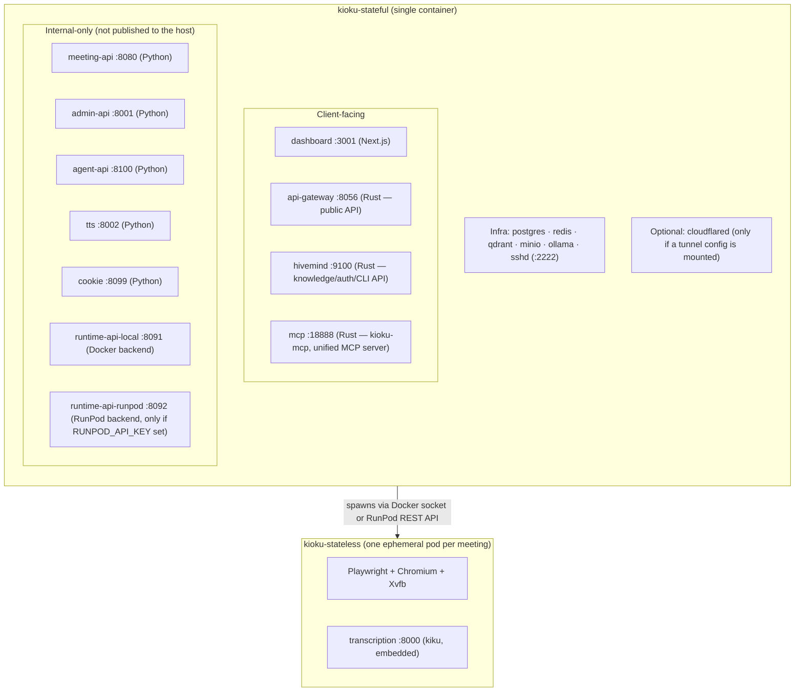

How Kioku's components fit together.

## Two images, not many containers

Kioku ships as two Docker images:

- **`kioku-stateful`** — one always-on container. Every backend service runs as a
  [supervisord](http://supervisord.org/)-managed process inside it (not as a separate
  container) — around 19 processes: Postgres, Redis, Qdrant, MinIO, Ollama, sshd, and 12
  application services. See [Docker Compose](/deployment/docker-compose) for the full
  process list.
- **`kioku-stateless`** — the ephemeral, per-meeting bot pod. Spawned on demand by
  runtime-api, one per active meeting, torn down when the bot exits. Bundles Playwright +
  Chromium + Xvfb + PulseAudio + the bot (TypeScript) + an embedded transcription service
  (Rust, [kiku](https://crates.io/crates/kiku)/whisper.cpp on GPU with CPU fallback, or
  cloud STT via OpenRouter).

`api-gateway` is not a thin reverse proxy — it validates API keys against admin-api,
enforces per-route scopes, and owns a substantial amount of application logic itself:
VNC/CDP browser-remote-control proxying, transcript-sharing links, a multiplexed
WebSocket, and live-meeting-context injection for agent chat. See
[Vexa](/architecture/vexa) for the full picture.

`hivemind` does **not** run its own MCP server — that capability was fully migrated into
the standalone `mcp` service (`kioku-mcp`, a Rust binary), which now hosts every MCP tool
— knowledge and meetings alike — behind one Streamable HTTP endpoint. See
[MCP overview](/mcp/overview).

## Data Flow

### Meeting → Knowledge

1. `kioku meet <link>` (or `POST /vexa/bots` on Hivemind, which proxies to Vexa
   meeting-api) requests a bot
2. runtime-api spawns a `kioku-stateless` pod (Docker container locally, or a RunPod pod)
3. The bot joins the meeting (Google Meet, Zoom, or MS Teams), captures audio
4. The pod's embedded transcription service (kiku/whisper.cpp, or cloud STT via
   OpenRouter) transcribes in real time → segments stream to Redis
5. meeting-api's collector consumer writes segments to Postgres
6. On exit, meeting-api finalizes the meeting and posts the transcript to Hivemind
7. Hivemind chunks and embeds the transcript via Ollama → stores vectors in Qdrant
8. Searchable via `POST /knowledge/search` or the `search` MCP tool

### Document → Knowledge

1. A PDF, DOCX, or PPTX is uploaded via `POST /knowledge/documents` (CLI: `kioku docs
   <path>`)
2. Hivemind extracts text (`pdf-extract` for PDF, `docx-rs` for DOCX, a custom zip/XML
   parser for PPTX, raw UTF-8 for TXT/MD), with an OCR fallback for scanned PDFs when
   extracted text is unexpectedly short
3. Text is chunked (400 words, 80-word overlap) and embedded via Ollama
   (`nomic-embed-text-v2-moe`) → stored in Qdrant
4. Searchable via `POST /knowledge/search`

### MCP Integration

1. An AI client (Claude, Cursor) connects to the unified `kioku-mcp` server's `/mcp`
   endpoint (Streamable HTTP)
2. It authenticates with a bearer token — either a Hivemind JWT/API key (routed straight
   to Hivemind's REST API for the 8 knowledge tools) or a Vexa API key (routed to the Vexa
   gateway for the 17 meeting/bot tools, with automatic exchange between the two)
3. The AI client calls any of the 25 registered tools; results come back as structured
   data it can reason about

See [MCP Tools](/mcp/tools) for the full list.
