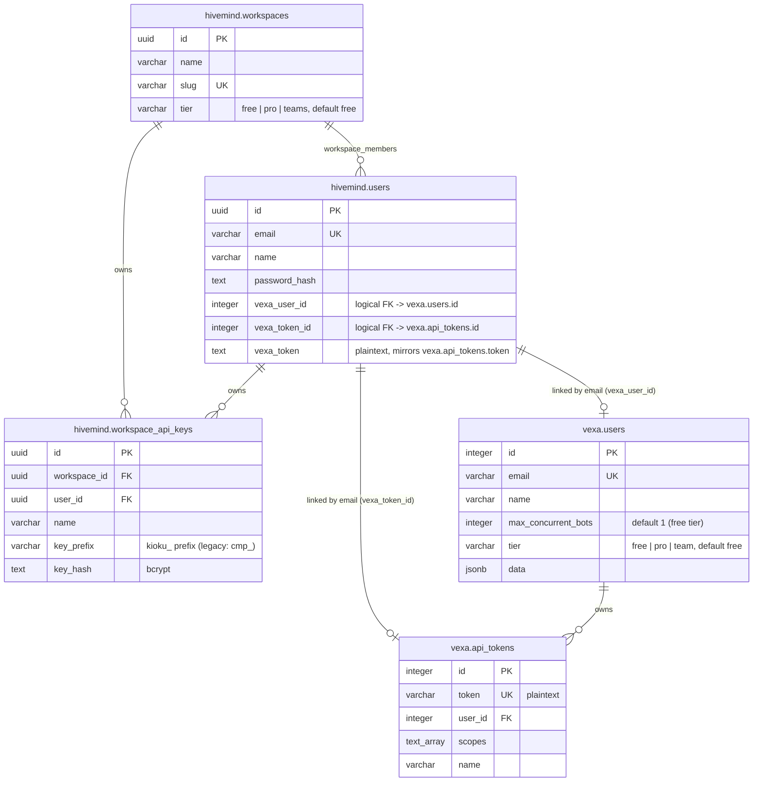

# Vexa ↔ Hivemind Credential Linking

Hivemind and Vexa are separate services with separate credential systems —
different schemas, different hashing, no shared users table. There is no
single merged "users" table; the two are linked by reference, not by schema
merge. This documents the resulting shape after the per-user Vexa token
link, with Hivemind's `company` → `workspace` rename applied.

## Schema

A single Hivemind `user` can belong to and switch between **multiple workspaces**
(`memberships` in the JWT) — the diagram above shows one user's membership edge into
one workspace, but the relationship is many-to-many via `workspace_members`.

## Why two systems, not one

- **Hivemind** (`services/hivemind`, schema `hivemind`): `kioku_<hex>` keys,
  bcrypt-hashed in `workspace_api_keys`. Owns CLI/MCP-facing auth — the
  credential a user actually holds (`kioku signin --api-key ...`).
- **Vexa** (`services/admin-api` + `services/meeting-api`, schema `vexa`):
  plaintext `api_tokens`, validated by `admin-api`'s `POST /internal/validate`.
  Owns bot-management auth (`X-API-Key` on the gateway's `/bots*` routes).

These predate each other and were never designed to share a credential
format (bcrypt hash vs. plaintext lookup can't be reconciled into one
literal string safely). Rather than force one raw secret to double as both,
each Hivemind user gets **their own linked Vexa user + Vexa token**,
provisioned lazily.

## Provisioning flow

1. A Hivemind user calls anything that proxies to Vexa (`POST /vexa/bots`,
   `GET /vexa/bots/status`, `DELETE /vexa/bots/:platform/:native_meeting_id`,
   `GET /vexa/meetings`, or the `GET /vexa/token` exchange endpoint).
2. `resolve_vexa_api_key` (`services/hivemind/src/handlers/vexa.rs`) checks
   `hivemind.users.vexa_token`. If already set, use it — no network call.
3. If unset, find-or-create the Vexa user by email
   (`POST {vexa_admin_api_url}/admin/users`, admin-api's existing
   find-or-create-by-email endpoint) and mint a token for them
   (`POST /admin/users/{id}/tokens`), both authenticated with the shared
   `vexa_admin_token` (an actual Vexa admin secret, not a per-user one).
4. Store the result on `hivemind.users` (`vexa_user_id`, `vexa_token_id`,
   `vexa_token`) so every future call for that user is a local read, not a
   re-provision.
5. If provisioning fails or isn't configured (`vexa_admin_token` empty),
   fall back to the shared `vexa_admin_token` directly — preserves the
   original single-shared-credential behavior rather than breaking outright.

This replaces "every Hivemind user's Vexa calls authenticate as one static
shared service account" with "every Hivemind user has their own Vexa
identity and token," without requiring a database/schema merge or any
downtime-risking migration of either service's existing credential table.

## MCP unification

The single unified MCP server (`services/mcp`, `kioku-mcp`, port 18888) hosts both the
knowledge tools and the meeting/bot tools behind one endpoint. For meeting/bot tools, it
calls `GET /vexa/token` on Hivemind first (`resolve_vexa_key` in `handler.rs`) to resolve
whichever Kioku credential it was given (JWT, `kioku_...` key, or a raw Vexa key) into the
caller's per-user Vexa API key, then forwards to the Vexa gateway as `X-API-Key`. For
knowledge tools, it forwards the caller's original bearer token straight to Hivemind, which
validates it itself. So `kioku mcp`'s single printed credential works against every tool —
knowledge and meetings alike. See [MCP overview](/mcp/overview) for the full tool list.
