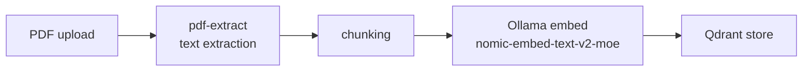

Document memory lets you upload PDFs — reports, specs, notes — so they're indexed in the same knowledge base as your meeting transcripts and searchable by semantic meaning.

## Upload

### Dashboard

Drag a PDF onto the **Documents** panel.

### REST API

```bash
curl -X POST http://localhost:9100/knowledge/documents \
  -H "Authorization: Bearer $TOKEN" \
  -F "file=@report.pdf"
```

### CLI

```bash
kioku knowledge-upload ./report.pdf
```

Processing is asynchronous — text extraction, chunking, and embedding happen on the server after upload returns.

## How It's Indexed



Each chunk is stored with:
- Document ID and filename
- Chunk index and text
- Embedding vector (256–768 dimensions, `nomic-embed-text-v2-moe`)
- Company ID (for multi-tenant isolation)

## Search

Documents and meetings are searched together in a single query:

```bash
curl -X POST http://localhost:9100/knowledge/search \
  -H "Authorization: Bearer $TOKEN" \
  -d '{"query": "Q3 revenue projections", "limit": 5}'
```

A result tagged `chunk_type: document` came from a PDF; `chunk_type: transcript` came from a meeting.

## List and Delete

```bash
# List
kioku knowledge-documents

# Delete (removes document + all its embeddings from Qdrant)
kioku knowledge-delete doc-1
```

Deletion is immediate and permanent — the document and all its vector embeddings are removed.
