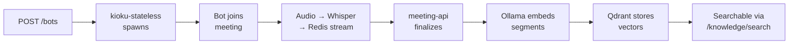

Meeting memory is Kioku's core feature: a bot joins your meeting, transcribes it in real time, and makes the full transcript searchable by semantic meaning.

## Lifecycle



## Transcription Engine

Each bot container runs a self-contained faster-whisper server (`localhost:8000` inside the pod):

- **Model**: `large-v3-turbo` by default (configurable via `BOT_WHISPER_MODEL`)
- **Compute**: `int8` quantization — best balance of speed, quality, and VRAM usage
- **GPU**: NVIDIA CUDA when available; falls back to CPU
- **Language**: auto-detected per segment; or set explicitly in the bot request

Model weights are downloaded once into a shared host volume and reused by all bot containers — no redundant downloads.

## Supported Platforms

| Platform | Status |
|---|---|
| Google Meet | Supported |
| Zoom | Supported |
| Microsoft Teams | Supported |

## Speaker Attribution

Transcripts are per-speaker, not just per-segment. Each chunk stores:

```json
{
  "speaker": "Alice",
  "text": "We should use RunPod for GPU overflow.",
  "start_time": 42.1,
  "end_time": 47.3
}
```

Speaker names come from the meeting platform's participant list when available.

## Bot Identity

By default, the bot joins as a guest named **Kioku** and waits in the waiting room to be admitted.

Authenticated mode (toggle in dashboard) attempts to use pre-stored browser session cookies so the bot joins as a registered Google/Zoom account. This requires cookies to be captured and stored in the cookie service first — see issue [#38](https://github.com/kioku-org/kioku/issues/38).

## Searching Meeting Memory

Once indexed, meeting content is searchable via semantic similarity:

```bash
# REST
curl -X POST http://localhost:9100/knowledge/search \
  -H "Authorization: Bearer $TOKEN" \
  -d '{"query": "what did we decide about the API design", "limit": 5}'

# CLI
kioku knowledge-search "API design decisions"

# MCP (ask your AI client)
# "What did we discuss about API design last month?"
```

Results include the matching text excerpt, speaker, meeting title, and timestamp.
