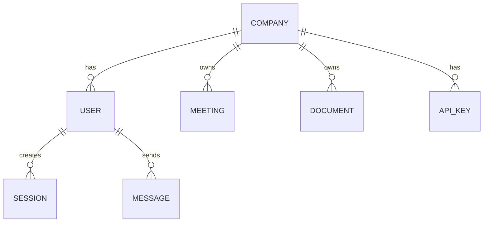

Kioku is multi-tenant by default. Every resource (meetings, documents, embeddings, bot sessions) is scoped to a **company**, and tenant isolation is enforced at the API layer before any data is read or written.

## Data Model

- Every `User` belongs to exactly one `Company`
- Every `Meeting`, `Document`, and vector embedding stores a `company_id`
- Every query in Qdrant is filtered by `company_id` — cross-tenant reads are structurally impossible at the API level

## Authentication and Isolation

1. User signs in → JWT issued (contains `user_id`, `company_id`, `role`)
2. Every API request verifies the JWT
3. All database queries AND Qdrant searches include a `company_id` filter derived from the token
4. No endpoint accepts a `company_id` parameter from the client — it comes only from the verified token

## Roles

| Role | Permissions |
|---|---|
| `admin` | Full access to company data, user management, API keys |
| `member` | Full access to company data, no user management |

## API Keys

Long-lived API keys (`koku_...` prefix) are scoped to a company. They can be:
- Created: `kioku auth-key-create`
- Listed: `kioku auth-key-list`
- Deleted: `kioku auth-key-delete <prefix>`

API keys are exchanged for a short-lived JWT at request time via `POST /auth/token` with an `X-API-Key` header.

## Self-Hosted Isolation

When self-hosting, you control the entire stack. Each Docker volume is unencrypted on disk — OS-level access controls apply. See [Storage](/security/storage) for details.

For complete isolation between tenants on shared infrastructure, run separate Kioku instances (separate Docker stacks, separate volumes, separate databases) rather than relying on application-level multi-tenancy.
