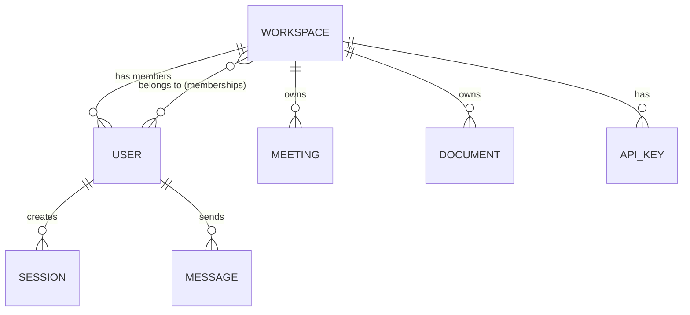

Kioku is multi-tenant by default. Every resource (meetings, documents, embeddings, bot
sessions) is scoped to a **workspace**, and tenant isolation is enforced at the API layer
before any data is read or written. A single user can belong to — and switch between —
multiple workspaces.

<Note>
  Hivemind's tenancy model was renamed from "company" to "workspace" (with multi-workspace
  membership added at the same time). Some internal identifiers still carry the old name
  for backward compatibility (e.g. the legacy `cmp_...` API key prefix), but the public
  API, CLI, and data model are all workspace-based now.
</Note>

## Data Model



- A `User` can have **memberships in multiple workspaces**, each with its own role.
- Every `Meeting`, `Document`, and vector embedding stores a `workspace_id`.
- Every query in Qdrant is filtered by `workspace_id` — cross-tenant reads are structurally impossible at the API level.

## Authentication and Isolation

1. User signs in → JWT issued, containing `user_id`, a default `workspace_id`, `role`, and the full list of `memberships: [{workspace_id, role}]`.
2. Every API request verifies the JWT.
3. The **active workspace** is resolved from an optional `X-Workspace-Id` header (must be one of the token's memberships) or falls back to the token's default workspace.
4. All database queries AND Qdrant searches include a `workspace_id` filter derived from the resolved active workspace.
5. No endpoint accepts a `workspace_id` parameter from the client body — it comes only from the verified token/header.
6. Signing out invalidates the token **server-side** (its `auth_tokens` row is deleted and re-checked on every subsequent request), not just client-side.

## Roles

| Role | Permissions |
|---|---|
| `admin` | Full access to workspace data, member/invite management, API keys |
| `member` | Full access to workspace data, no member/invite management |

## Tiers

| Tier | Limit |
|---|---|
| `free` (default) | 1 member per workspace |
| `pro` / `teams` | Multiple members via `kioku invite` |

Invite creation (and member registration against a pending invite) is blocked on the free tier once the 1-member cap is hit.

## Managing Workspaces

```bash
kioku ws                          # list your workspaces
kioku ws <name-or-slug>           # switch the active one
kioku ws --create "New Team"      # create a workspace
kioku invite <email>              # invite a teammate to the active workspace
```

See [Kioku CLI](/architecture/cli) for the full command reference.

## API Keys

Long-lived API keys (`kioku_...` prefix, legacy `cmp_...` still accepted) are scoped to a
workspace. They can be created, listed, and deleted via `kioku keys` or the
[Workspace API](/api/workspace).

API keys are exchanged for a short-lived JWT at request time via `POST /auth/token` with an `X-API-Key` header.

## Self-Hosted Isolation

When self-hosting, you control the entire stack. Each Docker volume is unencrypted on disk — OS-level access controls apply. See [Storage](/security/storage) for details.

For complete isolation between tenants on shared infrastructure, run separate Kioku instances (separate Docker stacks, separate volumes, separate databases) rather than relying on application-level multi-tenancy.
