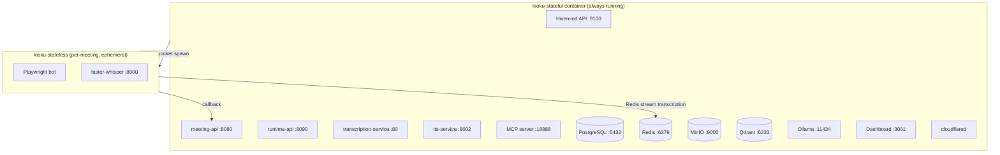

## Architecture

Kioku uses a two-image architecture:



All stateful services run as processes inside a single supervisord-managed container. The bot image is spawned on-demand via the Docker socket and removed after the meeting ends.

## Files

```
deployment/docker/
├── docker-compose.stateful.yml   # stateful services
├── docker-compose.stateless.yml  # bot image reference (build only)
├── Dockerfile.stateful
├── Dockerfile.stateless
├── .env.example
└── entrypoint-stateful-runtime.sh
```

## Ports Exposed to Host

| Port | Service | URL |
|---|---|---|
| 9100 | Hivemind API | `localhost:9100` |
| 8056 | Vexa API gateway | `localhost:8056` |
| 3001 | Dashboard | `localhost:3001` |
| 18888 | MCP server | `localhost:18888` |

All other ports (PostgreSQL, Redis, Qdrant, etc.) stay internal to the container.

## Starting the Stack

```bash
cd deployment/docker
cp .env.example .env
# fill in secrets (see .env.example for required fields)

docker compose -f docker-compose.stateful.yml up -d
```

## Environment Variables

See `.env.example` for the full reference. Critical ones:

| Variable | Description |
|---|---|
| `HIVEMIND_JWT_SECRET` | JWT signing secret (64-char hex) |
| `HIVEMIND_ENCRYPTION_SECRET` | Field encryption key (64-char hex) |
| `VEXA_ADMIN_API_TOKEN` | Admin API token |
| `NEXTAUTH_SECRET` | Dashboard session secret |
| `NEXTAUTH_URL` | Dashboard public URL |
| `VEXA_PUBLIC_URL` | Meetings API public URL |
| `DOCKER_GID` | Docker group GID (for socket access) |
| `VEXA_BOT_IMAGE` | Bot image (`ghcr.io/kioku-org/kioku-stateless:latest`) |
| `USE_LOCAL_RESOURCE` | `true` to spawn bots via Docker socket |
| `LOCAL_BOT_THRESHOLD` | Max local bots before overflow to RunPod |
| `RUNPOD_API_KEY` | Required if `USE_LOCAL_RESOURCE=false` |

## Volumes

All data persists across restarts in named volumes:

| Volume | Contents |
|---|---|
| `kioku-postgres-data` | All relational data |
| `kioku-qdrant-data` | Vector embeddings |
| `kioku-minio-data` | Meeting recordings |
| `kioku-redis-data` | Transcription streams |
| `kioku-ollama-data` | Embedding model weights |
| `kioku-whisper-model` | Whisper model cache (shared with bot containers) |
| `kioku-cookie-data` | Bot session cookies |
| `kioku-tts-voices` | TTS voice models |

## Upgrading

```bash
docker compose -f docker-compose.stateful.yml pull
docker compose -f docker-compose.stateful.yml up -d
```

## Common Operations

```bash
# View all process status (inside container)
docker exec kioku-stateful supervisorctl status

# View logs for a specific service
docker exec kioku-stateful supervisorctl tail -f meeting-api

# Restart a service
docker exec kioku-stateful supervisorctl restart runtime-api-local

# Shell into the container
docker exec -it kioku-stateful bash
```
