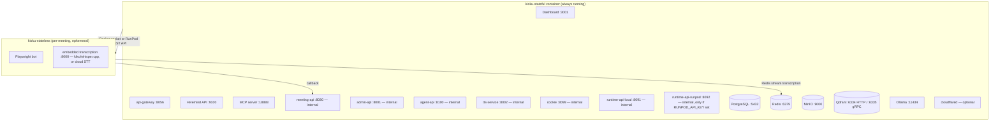

## Architecture

Kioku uses a two-image architecture:



All ~19 processes run under a single supervisord instance inside one `kioku-stateful`
container — not as separate containers. The bot image is spawned on demand (via the Docker
socket locally, or the RunPod REST API) and removed after the meeting ends.

<Note>
  There is no standalone `router` service on port 8090. Local-vs-RunPod backend selection
  is handled directly by meeting-api and api-gateway. See [Vexa](/architecture/vexa).
</Note>

## Files

```
deployment/docker/
├── docker-compose.stateful.yml   # the one real service: kioku-stateful
├── docker-compose.cpu.yml        # GPU-less override — drops nvidia device reservations
├── docker-compose.stateless.yml  # a one-shot whisper-model warmup job only — not the bot image itself
├── Dockerfile.stateful
├── Dockerfile.stateless
├── .env.example
├── entrypoint-stateful-runtime.sh  # generates the supervisord config at container start
└── Makefile                        # currently a tracked placeholder, no real targets yet
```

## Ports Exposed to Host

| Port | Service | URL |
|---|---|---|
| 9100 | Hivemind API | `localhost:9100` |
| 8056 | Vexa API gateway | `localhost:8056` |
| 3001 | Dashboard | `localhost:3001` |
| 18888 | MCP server | `localhost:18888` |
| 2222 | sshd (mapped from container port 22) | `ssh -p 2222 ...` |

Everything else — PostgreSQL, Redis, Qdrant, MinIO, Ollama, and all the internal Vexa
services (meeting-api, admin-api, agent-api, tts-service, cookie, runtime-api-*) — stays
internal to the container and is reachable only from processes inside it, or from
`kioku-stateless` bot pods via the `kioku-stateful` container-name hostname.

## Starting the Stack

```bash
cd deployment/docker
cp .env.example .env
# fill in secrets (see .env.example for required fields)

docker compose -f docker-compose.stateful.yml up -d
```

<Note>
  The `scripts/setup.sh`, `scripts/manage.sh`, and `scripts/healthcheck.sh` helper scripts
  in this directory predate the current single-container design — they still assume
  separate `kioku-hivemind`/`kioku-dashboard`/`kioku-ollama`/etc. containers and a Vexa
  Admin API on port 8057. They don't reflect the current topology and shouldn't be relied
  on as the primary path. Use `docker compose -f docker-compose.stateful.yml up -d`
  directly, and `docker exec kioku-stateful supervisorctl status` for health, until these
  scripts are updated.
</Note>

## Environment Variables

See `.env.example` for the full reference, and [Environment Variables](/deployment/environment-variables) for the complete table. Critical ones:

| Variable | Description |
|---|---|
| `HIVEMIND_JWT_SECRET` | JWT signing secret (64-char hex) |
| `HIVEMIND_ENCRYPTION_SECRET` | Field encryption key (64-char hex) |
| `VEXA_ADMIN_API_TOKEN` | Admin API token |
| `NEXTAUTH_SECRET` | Dashboard session secret |
| `NEXTAUTH_URL` | Dashboard public URL |
| `VEXA_PUBLIC_API_URL` | Public URL the browser uses for the dashboard's WebSocket connection — see the warning below |
| `DOCKER_GID` | Docker group GID (for socket access), auto-detected by `setup.sh` |
| `VEXA_BOT_IMAGE` / `BOT_IMAGE` | Bot image, default `ghcr.io/kioku-org/kioku-stateless:latest` |
| `USE_LOCAL_RESOURCE` | `true` to spawn bots via the Docker socket (default) |
| `LOCAL_BOT_THRESHOLD` | Max local bots before overflow to RunPod |
| `RUNPOD_API_KEY` | Required if overflowing to RunPod |

<Warning>
  `docker-compose.stateful.yml` still sets `VEXA_PUBLIC_API_URL` with a fallback of
  `https://meetings.kioku.chat` at the compose level. If you don't explicitly set
  `VEXA_PUBLIC_API_URL` in your `.env`, a self-hosted deployment's dashboard will silently
  point its browser-facing WebSocket at Kioku's own production domain instead of your
  server. Always set `VEXA_PUBLIC_API_URL` explicitly in `.env` for self-hosted
  deployments.
</Warning>

## Volumes

All data persists across restarts in named volumes:

| Volume | Contents |
|---|---|
| `kioku-postgres-data` | All relational data |
| `kioku-qdrant-data` | Vector embeddings |
| `kioku-minio-data` | Meeting recordings |
| `kioku-redis-data` | Transcription streams |
| `kioku-ollama-data` | Embedding model weights |
| `kioku-cookie-data` | Bot session cookies |
| `kioku-recordings-data` | Recording pipeline scratch/output |
| `kioku-whisper-models` | Cached local whisper.cpp model weights (used by the optional `kioku-whisper` shared-transcription service) |

Plus bind-mounts for the Docker socket, `runtime-profiles.yaml`, and (if configured) Cloudflare Tunnel credentials.

## Upgrading

```bash
docker compose -f docker-compose.stateful.yml pull
docker compose -f docker-compose.stateful.yml up -d
```

Or, to build from source after a `git pull` (the standard path — see the bugfix SOP if you're deploying a fresh code change):

```bash
git pull --ff-only origin master
docker compose -f docker-compose.stateful.yml build kioku-stateful
docker compose -f docker-compose.stateful.yml up -d
docker image prune -f
```

## Common Operations

```bash
# View all process status (inside container)
docker exec kioku-stateful supervisorctl status

# View logs for a specific service
docker exec kioku-stateful supervisorctl tail -f meeting-api

# Restart a service
docker exec kioku-stateful supervisorctl restart runtime-api-local

# Shell into the container
docker exec -it kioku-stateful bash
```
