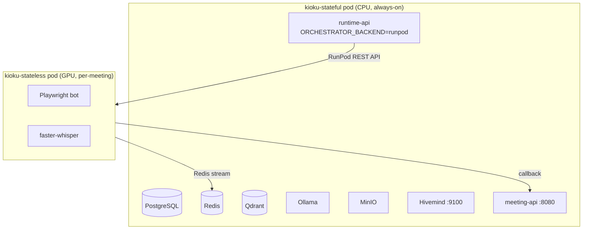
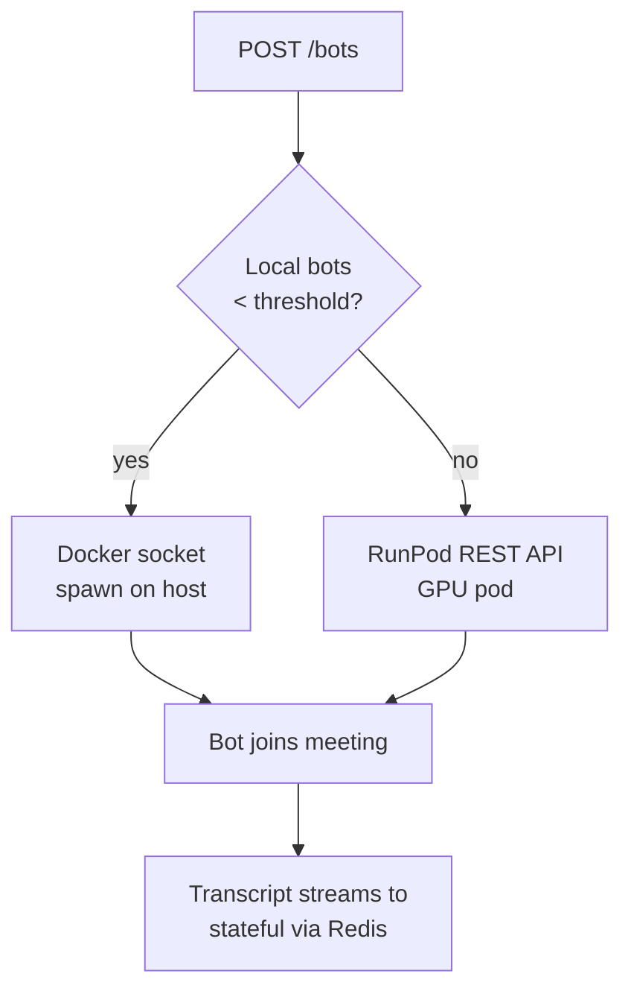

Kioku supports two RunPod deployment modes:

1. **Full stack on RunPod** — run stateful services on a persistent CPU pod; bot pods on GPU
2. **RunPod overflow** — run stateful services on your own server; overflow bot containers to RunPod GPU pods when local capacity is exhausted

## Architecture



## Images

| Image | Registry | Pod Type |
|---|---|---|
| `ghcr.io/kioku-org/kioku-stateful:latest` | GHCR | CPU, always-on |
| `ghcr.io/kioku-org/kioku-stateless:latest` | GHCR | GPU, ephemeral |

Images are built by GitHub Actions on every push to master.

## Mode 1: Full Stack on RunPod

1. In RunPod console, create a **Persistent Pod** (CPU type):
   - Image: `ghcr.io/kioku-org/kioku-stateful:latest`
   - Volume: attach a network volume at `/data`
   - Ports: 9100, 8056, 3001, 18888

2. Set env vars via RunPod's **Environment Variables** panel — see `.env.example` for the full list

3. Set bot callback URLs so ephemeral GPU pods can reach the stateful pod:
   ```
   VEXA_PUBLIC_URL=https://<pod-id>-8056.proxy.runpod.net
   BOT_MEETING_API_URL=http://<pod-id>-8080.proxy.runpod.net
   BOT_REDIS_URL=redis://:<REDIS_PASSWORD>@<pod-id>-6379.proxy.runpod.net:6379/0
   ```

4. Set RunPod bot orchestration:
   ```
   USE_LOCAL_RESOURCE=false
   RUNPOD_API_KEY=your_key
   RUNPOD_GPU_TYPES=NVIDIA GeForce RTX 3090,NVIDIA RTX A5000,NVIDIA RTX A4000
   RUNPOD_CLOUD_TYPE=COMMUNITY
   ```

## Mode 2: RunPod Bot Overflow (Recommended for Self-Hosted)

Run stateful services on your own server; overflow to RunPod when local Docker capacity is exceeded.

```bash
# .env
USE_LOCAL_RESOURCE=true
LOCAL_BOT_THRESHOLD=3         # up to 3 bots via Docker socket
RUNPOD_API_KEY=your_key       # overflow beyond 3 goes to RunPod
RUNPOD_GPU_TYPES=NVIDIA GeForce RTX 3090,NVIDIA RTX A5000
RUNPOD_CLOUD_TYPE=COMMUNITY
```



<Warning>
  When using RunPod overflow, Redis (:6379) and meeting-api (:8080) on your host must be reachable from the public internet. Open these ports in your firewall and set `BOT_REDIS_URL` and `BOT_MEETING_API_URL` to your server's public IP.
</Warning>

## Bot Pod Lifecycle

1. **Spawn** — runtime-api calls RunPod REST API → GPU pod created
2. **Boot** — pod pulls image (~30–60s), starts faster-whisper + bot
3. **Meeting** — bot joins, transcribes, streams to Redis
4. **Exit** — bot exits → reaper detects (15s poll) → pod deleted

<Note>
  Bot pod startup takes 30–60s on RunPod vs ~2s for Docker. Join meetings at least 1 minute before they start if using RunPod.
</Note>

## GPU Sizing

| GPU | VRAM | Concurrent bots (large-v3-turbo, int8) |
|---|---|---|
| RTX 3070 | 8 GB | 4–5 |
| RTX 3090 | 24 GB | 14–15 |
| A5000 | 24 GB | 14–15 |
| A100 (40 GB) | 40 GB | 25+ |

## Cost

| Resource | Rate | Note |
|---|---|---|
| Stateful CPU pod | ~$0.10–0.20/hr | Always-on if hosted on RunPod |
| Bot GPU pod | ~$0.27–0.46/hr | Only costs while meeting is in progress |
| Network volume (20 GB) | ~$0.10/GB/mo | ~$2/mo |

A 1-hour meeting costs ~$0.27–0.46 in GPU compute.

## Security

- **Redis** — requires `REDIS_PASSWORD`; port 6379 must be exposed for RunPod bots
- **PostgreSQL** — internal only, never exposed
- **MinIO / Qdrant** — internal only
- **meeting-api** — uses `INTERNAL_API_SECRET` for bot callbacks
