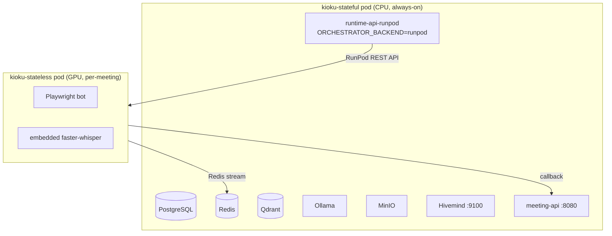
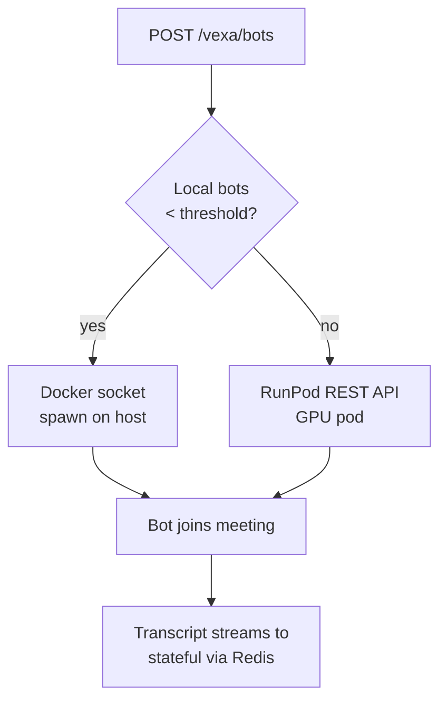

Kioku supports two RunPod deployment modes:

1. **Full stack on RunPod** — run stateful services on a persistent CPU pod; bot pods on GPU
2. **RunPod overflow** — run stateful services on your own server; overflow bot pods to RunPod GPU pods when local capacity is exhausted

## Architecture



## Images

| Image | Registry | Pod Type |
|---|---|---|
| `ghcr.io/kioku-org/kioku-stateful:latest` | GHCR | CPU, always-on |
| `ghcr.io/kioku-org/kioku-stateless:latest` | GHCR | GPU, ephemeral |

Images are built and pushed by GitHub Actions on every push to `master`/`main` and on published releases.

<Note>
  Whether these GHCR packages are public is not independently confirmed — RunPod has no
  mechanism to pass an image-pull secret, so if pulls fail on a fresh pod, check the
  package visibility on GHCR first.
</Note>

## Using the deploy script (recommended)

`deployment/docker/scripts/runpod/deploy.sh` automates the full-stack-on-RunPod mode using
`runpodctl` (not raw REST calls). It reads its own `.env` at `deployment/docker/scripts/runpod/.env`
(separate from `deployment/docker/.env`) — required keys: `RUNPOD_API_KEY`,
`HIVEMIND_JWT_SECRET`, `HIVEMIND_ENCRYPTION_SECRET`, `VEXA_ADMIN_API_TOKEN`.

It builds the pod's environment automatically (covering ~35 keys — DB, Hivemind, RunPod,
storage, OAuth, `MIN_BOT_POOL`, etc.), **forces `USE_LOCAL_RESOURCE=false`** (there's no
Docker socket on a RunPod pod), and auto-generates `NEXTAUTH_SECRET` if you didn't set one.
It exposes ports `22, 6379, 8080, 9100, 8056, 3001, 18888, 8002, 8099` — including TTS
(8002) and cookie (8099), which earlier revisions of this script missed.

```bash
cd deployment/docker/scripts/runpod
cp .env.example .env   # if present, else create with the required keys above
./deploy.sh
```

Tear down with `./destroy.sh <pod-id>` (prompts for confirmation).

## Manual Setup: Full Stack on RunPod

1. In RunPod console, create a **Persistent Pod** (CPU type):
   - Image: `ghcr.io/kioku-org/kioku-stateful:latest`
   - Volume: attach a network volume at `/data`
   - Ports: 9100, 8056, 3001, 18888, 8002, 8099

2. Set env vars via RunPod's **Environment Variables** panel — see `.env.example` for the full list

3. Bot-facing URLs are resolved automatically once `RUNPOD_POD_ID` is set (RunPod
   auto-injects it): `BOT_MEETING_API_URL`/`BOT_TTS_URL`/`BOT_COOKIE_URL` resolve to
   `https://<pod-id>-<port>.proxy.runpod.net`, and `BOT_REDIS_URL` to
   `RUNPOD_PUBLIC_IP:RUNPOD_TCP_PORT_6379`. You don't need to set these manually.

4. Set RunPod bot orchestration:
   ```
   USE_LOCAL_RESOURCE=false
   RUNPOD_ACCOUNT_API_KEY=your_key
   RUNPOD_GPU_TYPES=NVIDIA GeForce RTX 3090,NVIDIA RTX A5000,NVIDIA RTX A4000
   RUNPOD_CLOUD_TYPE=COMMUNITY
   ```
   <Note>
     Use `RUNPOD_ACCOUNT_API_KEY`, not `RUNPOD_API_KEY`, inside a pod that is itself
     RunPod-hosted — RunPod auto-injects its own pod-scoped `RUNPOD_API_KEY` into every pod
     it hosts, which would otherwise shadow your account key. `RUNPOD_ACCOUNT_API_KEY` is
     always preferred when set; `RUNPOD_API_KEY` is the fallback for non-RunPod-hosted
     deployments (e.g. Docker Compose on your own server, overflowing to RunPod).
   </Note>

## Mode 2: RunPod Bot Overflow (Recommended for Self-Hosted)

Run stateful services on your own server; overflow to RunPod when local Docker capacity is exceeded.

```bash
# .env
USE_LOCAL_RESOURCE=true
LOCAL_BOT_THRESHOLD=3         # up to 3 bots via Docker socket
RUNPOD_API_KEY=your_key       # overflow beyond 3 goes to RunPod
RUNPOD_GPU_TYPES=NVIDIA GeForce RTX 3090,NVIDIA RTX A5000
RUNPOD_CLOUD_TYPE=COMMUNITY
```



<Warning>
  When using RunPod overflow, Redis (:6379) and meeting-api (:8080) on your host must be reachable from the public internet. Open these ports in your firewall.
</Warning>

## Warm pool (`MIN_BOT_POOL`)

Set `MIN_BOT_POOL=N` to keep `N` bot pods pre-spawned and idle (image already pulled) so a
real meeting request claims one instantly instead of cold-spawning and waiting on the
~3.8GB stateless image to pull. Idle pods block on a Redis `BLPOP` for their real config; a
background pool loop tops the pool back up whenever a slot is claimed or a pod dies.
Default `0` (disabled). Only wired for RunPod deploys — not exposed in the plain
`docker-compose.stateful.yml` environment block, so set it via the RunPod `.env` or
console.

## Orphan pod cleanup

Every reaper tick, the RunPod backend also reconciles against the **full** RunPod account
pod list (not just what's tracked in Redis) and deletes any already-exited pod matching
Kioku's bot name prefixes — this catches pods that fell out of the Redis tracking registry,
e.g. because the stateful pod (which also hosts Redis) itself got recreated mid-meeting.

## Bot Pod Lifecycle

1. **Spawn** — runtime-api-runpod calls the RunPod REST API → GPU pod created (or an idle warm-pool pod is claimed)
2. **Boot** — pod pulls the image (~30–60s on cold-spawn, instant on a pool claim), starts the embedded faster-whisper server + bot
3. **Meeting** — bot joins, transcribes, streams to Redis
4. **Exit** — bot exits → reaper detects (polls every `RUNPOD_POLL_INTERVAL`, default 15s) → pod deleted

<Note>
  Cold-spawned bot pod startup takes 30–60s on RunPod vs ~2s for Docker. Enable
  `MIN_BOT_POOL` to eliminate this for the common case, or join meetings at least a minute
  early if you don't.
</Note>

## GPU Sizing

| GPU | VRAM | Concurrent bots (large-v3-turbo, int8) |
|---|---|---|
| RTX 3070 | 8 GB | 4–5 |
| RTX 3090 | 24 GB | 14–15 |
| A5000 | 24 GB | 14–15 |
| A100 (40 GB) | 40 GB | 25+ |

## Cost

| Resource | Rate | Note |
|---|---|---|
| Stateful CPU pod | ~$0.10–0.20/hr | Always-on if hosted on RunPod |
| Bot GPU pod | ~$0.27–0.46/hr | Only costs while a meeting is in progress (or while pooled idle, if `MIN_BOT_POOL` is set) |
| Network volume (20 GB) | ~$0.10/GB/mo | ~$2/mo |

A 1-hour meeting costs ~$0.27–0.46 in GPU compute.

## Security

- **Redis** — requires `REDIS_PASSWORD`; port 6379 must be exposed for RunPod bots
- **PostgreSQL** — internal only, never exposed
- **MinIO / Qdrant** — internal only
- **meeting-api** — uses `INTERNAL_API_SECRET` for bot callbacks
