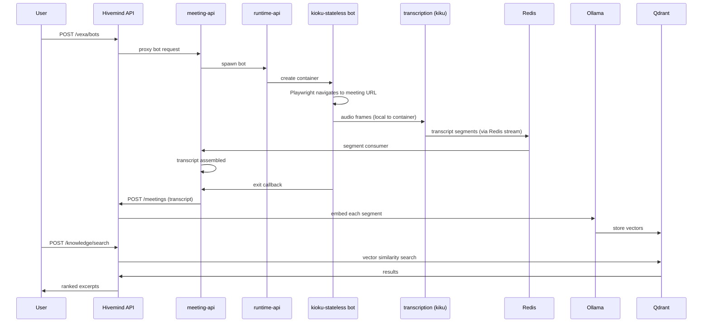

This page describes the data paths in a self-hosted deployment. Hosted Kioku follows the
same product flow, but its services run on Kioku-managed infrastructure.

## Meeting Capture Flow

## Where meeting data goes

In a local Docker deployment, the bot captures audio and the configured transcription
workload processes it on infrastructure you operate. Transcript segments are assembled,
stored, and indexed for workspace search.

If you configure RunPod for overflow or remote bot execution, the corresponding bot and
transcription workload run on RunPod. Treat the meeting data required for that workload as
leaving your infrastructure. See [RunPod](/deployment/runpod).

## Where Embeddings Are Computed

`nomic-embed-text-v2-moe` runs locally via Ollama. Transcript text is embedded on your machine and stored in your local Qdrant instance. No text leaves your server for the embedding step.

## External Services

By default, Kioku calls no external APIs. External calls are only made if you explicitly configure:

| Service | Trigger | Data sent |
|---|---|---|
| Dashboard AI chat provider | `AI_MODEL` + `AI_API_KEY` set (`AI_MODEL` selects the provider, e.g. `openai/gpt-4o`, `anthropic/claude-...`, or an Azure/OpenRouter-compatible endpoint) | Chat messages sent to whichever provider `AI_MODEL` points at |
| Anthropic API | `ANTHROPIC_API_KEY` set | agent-api's in-meeting AI agent (a Claude Code CLI container) sends session content to Claude — this is the only LLM provider agent-api reads |
| RunPod API | `RUNPOD_API_KEY` set | Remote bot execution and its required capture/transcription traffic |
| OpenRouter API | `STT_BACKEND=chirp` or `gpt4o` | Raw meeting audio, sent for cloud transcription (Google Chirp 3 / OpenAI gpt-4o-mini-transcribe) instead of local whisper.cpp |
| Cloudflare Tunnel | `cloudflared` running | Encrypted tunnel traffic (no plaintext) |

## Data at Rest

| Data | Location | Encryption |
|---|---|---|
| Transcripts + meetings | PostgreSQL (`kioku-postgres-data` volume) | Plaintext (disk-level encryption is your responsibility) |
| Vector embeddings | Qdrant (`kioku-qdrant-data` volume) | Plaintext |
| Optional meeting recordings | MinIO (`kioku-minio-data` volume) and `kioku-recordings-data` | Plaintext |
| Bot session cookies | Cookie service (`kioku-cookie-data` volume) | Plaintext |
| Model weights | Ollama / whisper.cpp volumes | N/A (public models) |
